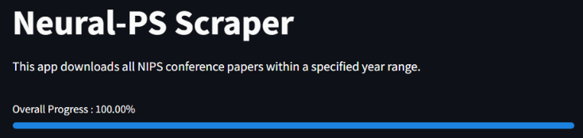
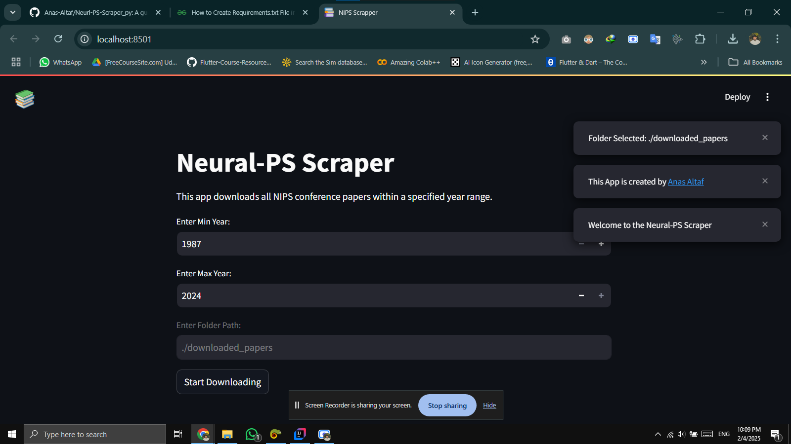
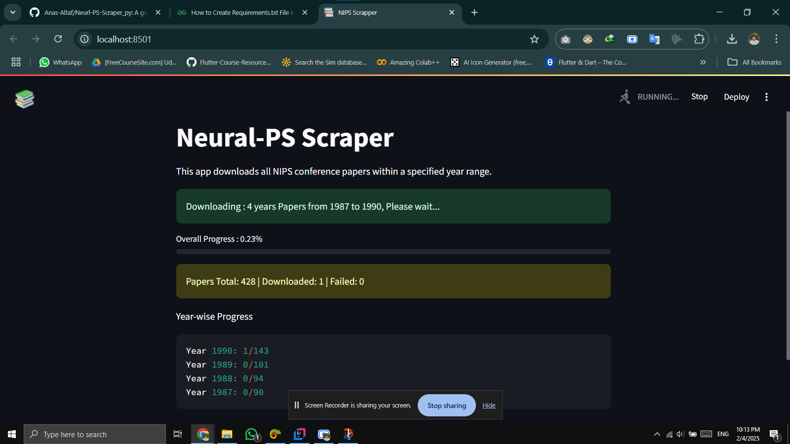
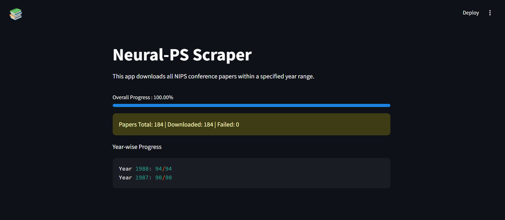
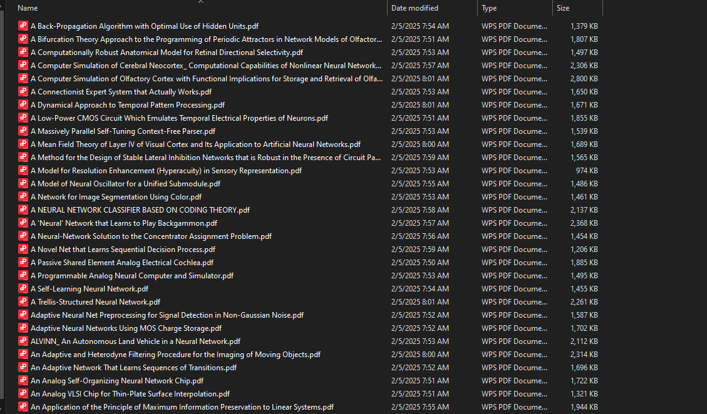

> # Neurl-PS-Scraper_py

**A Python-based Web tool to scrape NeurIPS papers effortlessly.**



> ## Overview

Neurl-PS-Scraper_py is a user-friendly application designed to help you fetch and manage papers from the NeurIPS
conference with ease. Whether you're a researcher, student, or enthusiast, this tool simplifies the process of gathering
the latest research papers.

## For downloaded data Annotation,

> ### visit :  [Data Annotator](https://github.com/Anas-Altaf/Doc-Annotator_py.git)

> ## Features

- #### **✅Intuitive GUI:**
    - Navigate through a simple interface to search and download papers.
- #### **📚Efficient Scraping:**
    - Quickly fetch paper metadata and PDFs.
- #### **♻Progress Tracking:**
    - Monitor the scraping process in real-time.
- #### **📑Metadata Storage:**
    - Save and manage paper details for future reference.

> ## Installation

1. **Clone the Repository:**

   ```bash
   git clone https://github.com/Anas-Altaf/Neurl-PS-Scraper_py.git
   cd Neurl-PS-Scraper_py
   ```

2. **Set Up a Virtual Environment (Optional but recommended):**

   ```bash
   python3 -m venv venv
   source venv/bin/activate  # On Windows, use venv\Scripts\activate
   ```

3. **Install Dependencies:**

   ```bash
   pip install -r requirements.txt
   ```

> ## Usage

1. **Run the Application:**
    2. Cli Version
       ```bash
       python scraper-cli.py
       ```
    3. GUI Version
       ```bash
       streamlit run scraper-gui.py
       ```

2. **Using the GUI:**
    - **Search Papers:** Enter your query to find relevant NeurIPS papers.
    - **Download:** Select papers and click 'Download' to save PDFs to your local machine.
    - **View Metadata:** Access detailed information about each paper.

> ## Video


https://github.com/user-attachments/assets/b4573464-108c-4035-960e-76403545607d

[Youtube Video](https://www.youtube.com/watch?v=75J9UWWFVjs)
> ## Screenshots

*The main interface of Neurl-PS-Scraper_py.*

*The application processing the scrapping.*

*Downloading the papers.*

*The downloaded papers.*

> ## Contributing

Contributions are welcome! Feel free to fork this repository, make improvements, and submit a pull request.

> ## License

This project is licensed under the MIT License.
